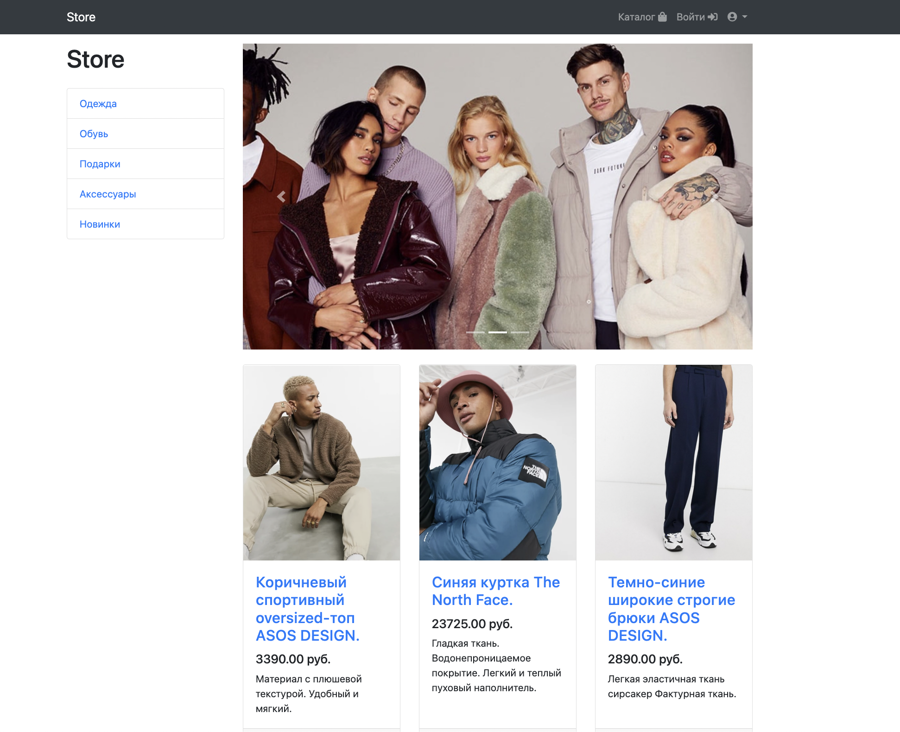

<!-- Improved compatibility of back to top link: See: https://github.com/othneildrew/Best-README-Template/pull/73 -->

<!-- PROJECT LOGO -->

  <h1 align="center">Интернет магазин</h1>
  

    Pet-project
      

<!-- TABLE OF CONTENTS -->

  
Оглавление

  <ol>
    <li>
      <a href="#О-проекте">О Проекте</a>
      <ul>
        <li><a href="#Использованые-инструменты-для-создания-проекта">Инструменты проекта</a></li>
      </ul>
    </li>
    <li>
      <a href="#Начало-работы">Начало работы</a>
      <ul>
        <li><a href="#Установка-и-запуск">Установка и запуск</a></li>
      </ul>
    </li>
    <li><a href="#Описание-и-процесс-работы">Описание и процесс работы</a></li>
    <li><a href="#Улучшения">Улучшения</a></li>
    <li><a href="#Контакты">Контакты</a></li>
    <li><a href="#Знания">Знания</a></li>
  </ol>

<!-- ABOUT THE PROJECT -->
## О проекте

Мой второй большой проект после самостоятельного изучения языка Python по различным курсам. 
Сделан по серии роликов в интернете, с помощью обучающих материалов, англоязычных ресурсов (Stackoverflow и тд), и, конечно, не без подсказок более опытных коллег в телеграмм-каналах. 
Задачи проекта:
- создать online магазин с помощью фрэймворка Django и закрепить уже имеющиеся знания по этой платформе.
- заменить стандартную для Django базу данных SQL на Postgres.
- понять работу программной платформы Docker, а именно запустить в Docker'e контейнеры с  Python, Django, Postgres.
- понять работу систем Celery и Redis.
- создать возможность авторизации и регистрации пользователя, корзину товаров и личный кабинет.
- изучить систему управления БД и подключить платежную систему.

(<a href="#readme-top">back to top</a>)

